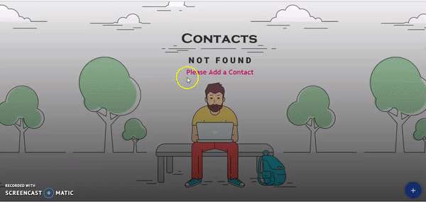

# Evolent App

> Designed and implemented a production ready application for maintaining contact information

> Technology used: `Angular 6` , `Angular Material` , `RxJS`, and `Bootstrap 4`

> Live application can be accessed from : [Evolent - Faran - Code](https://evolent-faran.firebaseapp.com/) 

---

## Table of Contents (Optional)

- [Installation](#installation)
- [Features](#features)
- [Screencasts](#screencasts)


---


## Installation

> Please run below command to install node modules in order to run this app locally

```shell
$ npm install
```
---

## Features

> Expected functionality:
- Add a contact
- List contacts
- Edit contact
- Delete contact

> Out of excitement, I have added:
- Search a contact

---
## Screencasts




---

## Browser List

> Best user experience can be enjoyed on:
- Google Chrome
- Mozilla Firefox
- Safari
- Microsoft Edge


---

## FAQ

- **How do I do *specifically* so and so?**
    - No problem! Just do this.

---

## Support

Reach out to me at one of the following places!

- Website at <a href="http://fvcproductions.com" target="_blank">`fvcproductions.com`</a>
- Twitter at <a href="http://twitter.com/fvcproductions" target="_blank">`@fvcproductions`</a>
- Insert more social links here.

---
